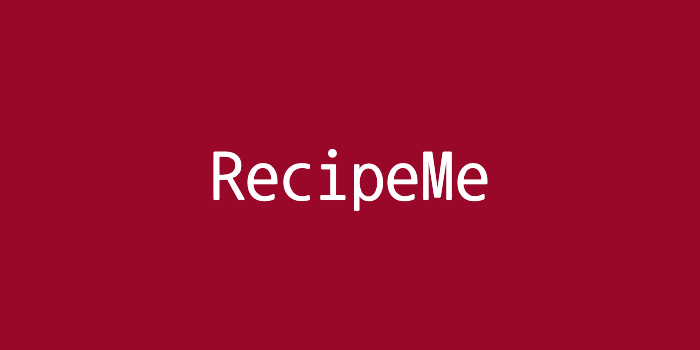

    

## About RecipeMe

**RecipeMe** is a project that allows users to discover culinary delights through exploring and searching for well-loved or new recipes! Featuring a **search functionality**, **recipe bookmarking** (_WIP_) and a **'What's in my fridge?' recipe finder** (_WIP_). Join on GitHub to contribute and enjoy culinary adventures!

#### View the deployed website [here](https://recipe-me-project.vercel.app/)

### Demo

## Tech stack

- 
- 
- 
- 
- 
- 

## To get started

- Download or clone repository
- Run `npm install`
- Once completed run `npm run dev`

Open [http://localhost:3000](http://localhost:3000) with your browser to see the result.

## Status

**RecipeMe** is still in progress. The next stage is fully implementing the bookmark feature

## Shoutouts
